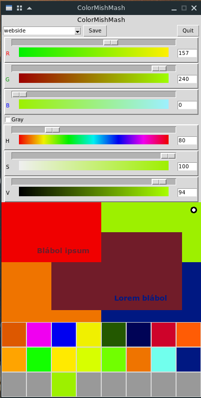

ColoMishMash
========================

Color mixer in TkInter

* dependences: Python3 and TkInter
* RGB and HSV

How to use?
-------------------

* click to color-gradient to select color
* right-click to pane for change destination
* click to pane for pick color, click to panto to paste color
* one click to color-string to clipboard
* save and load named sessions
* Shift+Q for quit

